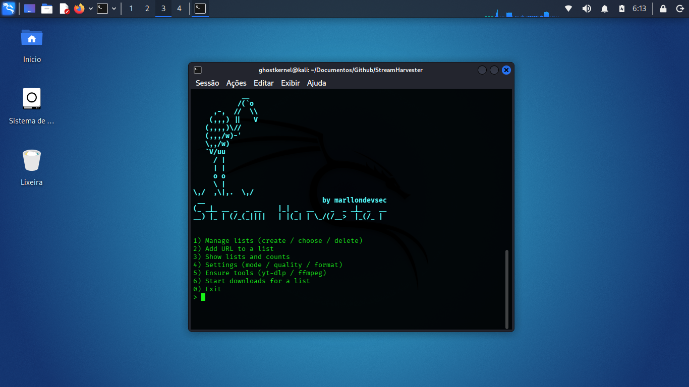

<p align="center">
  
</p>

# StreamHarvester

## Quick Summary

**StreamHarvester** is a single-file **C++17 CLI tool** for managing, downloading, and optionally converting media (video/audio) using **yt-dlp** and **ffmpeg**.

It organizes downloads into **named URL lists**, automatically bootstraps required tools into the `internals/` directory (best-effort), displays **live download progress**, and removes entries from lists after successful downloads.

### Primary Goals

* Simple list-based workflows
* Repeatable, resumable downloads
* Minimal setup with optional media conversion (MP4 / MP3)

---

## Key Features

* **Named URL lists**
  Lists are stored as plain text files in `internals/lists/<listname>.txt`.

* **Automatic cleanup**
  URLs are removed from the list once the download completes successfully.

* **Automatic tool bootstrap (best-effort)**
  Attempts to download `yt-dlp` and install `ffmpeg` into the `internals/` directory.

* **Persistent configuration**
  User preferences are stored in `internals/config.cfg`.

* **Progress UI**
  Parses yt-dlp output to display percentage, ETA, and an animated spinner.

* **Cross-platform support**
  Works on Linux and Windows with ANSI-aware terminal output.

* **Media conversion support**

  * Video recoding: `--recode-video mp4`
  * Audio extraction: `-x --audio-format mp3`

---

## Project Layout (generated at runtime)

```text
./StreamHarvester                # compiled binary
./StreamHarvester.cpp            # source file
downloads/                       # final downloaded & converted media
internals/
  yt-dlp                         # yt-dlp executable
  ffmpeg                         # ffmpeg executable
  config.cfg                     # persistent configuration
  lists/
    movies.txt
    podcasts.txt
```

---

## Build & Requirements

### Requirements

* C++17-compatible compiler (`g++`, `clang++`, or MinGW)
* `curl` and `tar` (recommended on Linux)
* PowerShell available on Windows (for ffmpeg installation)

### Build

#### Linux / macOS / WSL

```bash
g++ -std=c++17 -O2 -Wall StreamHarvester.cpp -o StreamHarvester
```

#### Windows (MSYS2 / MinGW)

```bash
g++ -std=c++17 -O2 -Wall StreamHarvester.cpp -o StreamHarvester.exe
```

---

## First Run / Startup Behavior

On first execution, StreamHarvester will:

* Enable ANSI terminal output (when supported)
* Create required directories:

  * `internals/`
  * `internals/lists/`
  * `downloads/`
* Attempt to download `yt-dlp`
* Attempt a best-effort installation of `ffmpeg`
* Display an ASCII banner and launch the interactive menu

If automatic installation fails, use **Menu → Ensure tools** or install the binaries manually.

---

## Usage (Interactive Mode)

Run:

```bash
./StreamHarvester
```

### Main Menu Options

1. **Manage lists**
   Create, inspect, or delete named URL lists.

2. **Add URL to a list**
   Select a list and append one or more URLs.

3. **Show lists and counts**
   View all lists and the number of queued URLs.

4. **Settings**
   Configure:

   * Mode: `video` | `audio`
   * Quality: `best`, `720`, `1080`, or custom
   * Target format: `original` | `mp4` | `mp3`

   Settings are stored in `internals/config.cfg`.

5. **Ensure tools**
   Retry installation of `yt-dlp` and `ffmpeg`.

6. **Start downloads for a list**
   Download items sequentially with automatic list cleanup.

---

## Example Workflow

```text
Main menu → 1 → n → my_series
Main menu → 2 → select my_series → add URLs
Main menu → 4 → configure mode / quality / format
Main menu → 5 → ensure tools (optional)
Main menu → 6 → start downloads
```

After a successful download, entries are removed from:

```text
internals/lists/my_series.txt
```

---

## Configuration File

**Location:** `internals/config.cfg`

```ini
mode=video
quality=best
format=original
```

---

## Behavior Notes

* Merging separate audio/video streams requires `ffmpeg`
* MP4 conversion uses `--recode-video mp4`
* MP3 extraction uses `-x --audio-format mp3`
* Progress display depends on yt-dlp output format and is best-effort

---

## Troubleshooting

### ffmpeg not found

```bash
sudo apt install ffmpeg
```

Or place `ffmpeg` / `ffmpeg.exe` manually inside `internals/`.

### yt-dlp not found

```bash
curl -L -o internals/yt-dlp \
https://github.com/yt-dlp/yt-dlp/releases/latest/download/yt-dlp
chmod +x internals/yt-dlp
```

---

## Legal / Responsible Use

Use StreamHarvester only for media you are legally allowed to download.
Always respect copyright laws and platform Terms of Service.

StreamHarvester does **not** bypass DRM or platform protections.

---

## Roadmap

* Parallel downloads
* Non-interactive batch mode
* Cookies and authenticated sessions
* Logging and verbose/debug mode
* Improved TUI (ncurses-style interface)
